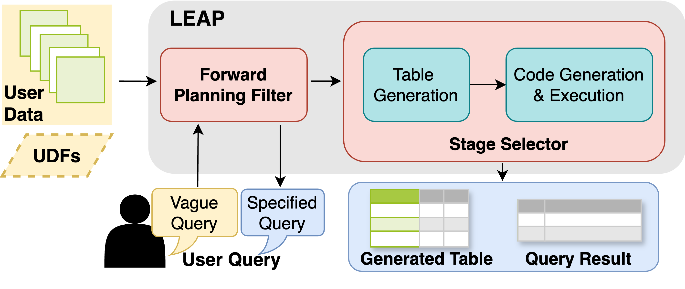

# LEAP and QUIET-ML


[](https://arxiv.org/abs/2501.03892)

This repository contains the code for the following paper,

**[LEAP: LLM-powered End-to-end Automatic Library for Processing Social Science Queries on Unstructured Data (VLDB'25)](https://arxiv.org/abs/2501.03892)**<br/>
*Chuxuan Hu, Austin Peters, and Daniel Kang*

In this paper, we introduce LEAP, an end-to-end library designed to support social science research by automatically analyzing user-collected unstructured data in response to their natural language queries. 
Along with LEAP, we present QUIET-ML, a dataset that comprehensively covers 120 popular queries in social science research. 
LEAP achieves 100\% pass @ 3 and 92\% pass @ 1 with an average cost being \$1.06 per query on QUIET-ML. Please refer to our paper for more details.



### Installing and Importing
You can install LEAP and QUIET-ML from PyPI with pip:
```bash
pip install autopipeline==0.1.393
```

After importing the library, you should set up your openai key and organization ID:
```python
import autopipeline
autopipeline.api_key = "your-openai-api-key"
autopipeline.organization = "your-openai-organization"
```


## LEAP

You can execute LEAP using one function:
```python
from autopipeline.Interactive import leap
result, table = leap(query, data, description)
```
Here, ```query``` is user query in natural language, ```data``` contains the unstructured data, ```description``` contains the description for the unstructured data, which can be provided by the user, or generated with a provided helper function:

```python
from autopipeline.util import formalize_desc
desc_dict = {"doc_id": "the pdf document id", "pdf_orig": "the pdf document"}
description = formalize_desc(desc_dict)
```

```result``` is the response to ```query``` on ```data```, and ```table``` contains all necessary information to answer ```query```.

### LEAP's General Use Case Demo

We provide the following examples to demonstrate the features and use cases of LEAP:

[General introduction (non-vague queries w/o unspecified numerical values)](https://colab.research.google.com/drive/1laBaZA3RXZE0TKSxykWHvRLlHimphaBe?usp=sharing)

[Vague queries](https://colab.research.google.com/drive/1B12VcHsjdpyMpS7pK5EAbNKtQGw2h8LC?usp=sharing)

[Non-vague queries with unspecified numerical values](https://colab.research.google.com/drive/1MLgZbzjKnMX2TNsyhuI85WnfwgGnUAWm?usp=sharing)

If you didn't find the ML functions you need in [LEAP's internal function list](https://docs.google.com/document/d/1lkNjB6OtJ4EYeme__qR8PKqfLK83GgctJEiK6kdcDHk/edit?usp=sharing), feel free to
[Add UDFs](https://colab.research.google.com/drive/1S761AO1OyzIpk3AB8FK9i0OolaOLnR2I?usp=sharing).

### Using LEAP in Legal Research

We invite a legal researcher to utilize LEAP in their research. Below are representative examples that have proven to be helpful:

[Named entity recognition (NER)](https://colab.research.google.com/drive/17sx1jV7Z32S81RBZ0uuHLKx_TOrNXDoW?usp=sharing)

[Part of speech (POS)](https://colab.research.google.com/drive/1OhZ4RZcvYR6nriUVv__LMC-PPeISW4WG?usp=sharing)

[Legal text summary](https://colab.research.google.com/drive/1wU22vzfP9_-fYHOx4VamYOGpPMzkTG3S?usp=sharing)

[Legal document analysis](https://colab.research.google.com/drive/1u-tgrCY3CiXr2W_nix0GATJ0P4YWHBOA?usp=sharing)

## QUIET-ML

QUIET-ML consists of 40 real-world social science research questions, the corresponding unstructured data, and the answers to these questions. 
You can load the QUIET-ML dataset from the library:
```python
from autopipeline.data import QUIET_ML
dataset = QUIET_ML()
```
You can access a specific query with its ```qid``` (ranging from 1 to 40):
```python
query_struct = dataset.query(qid)
```
```query_struct``` is a dictionary where ```query_struct["query"]``` is the social science query in natural language, ```query_struct["data"]``` contains the unstructured data, and ```query_struct["desc"]``` contains decriptions to the unstructured data.

### Reproduction
To reproduce our quantitative results, we provide the following example codes to load and test queries in QUIET-ML using LEAP:

[Testing QUIET-ML](https://colab.research.google.com/drive/16ogM_kXwJF0Zl2rqsBDukHFWEcthPGd-?usp=sharing)
